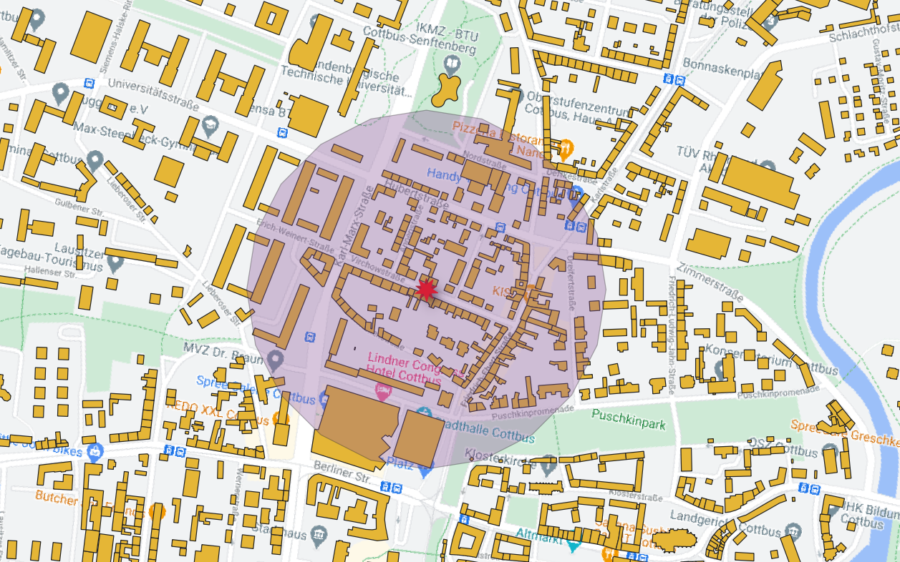
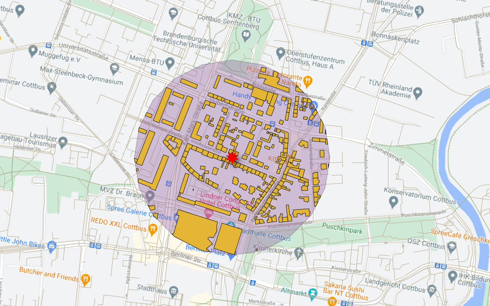

# WW2-bomb-evacuation-area
On Monday, 01.03.2021 a WW2 bomb will be defused in Virchow Street in Cottbus.

## Evacuation is required. During the defusion, no one is allow to stay in the area of 300 m from Virchowstraße, Cottbus.

## To work on QGIS

### Step 1: Download Building shapefile, Road shapfile from
```
https://download.geofabrik.de/europe/germany.html
```

### Step 2: Google Map basemap in QGIS 
```
XYZ Tiles -> Google Map
```

### Step 3: Create a point vector
```
Layer -> Create Layer -> New Shapefile Layer  

File name:          click ... to select proper source (Must) 
File encoding:      UTF-8
Geometry type:      Point
CRS:                EPSG:32635 - WGS 84 / UTM zone 35N (This CRS helps to create buffer in meter unit)
```

### Step 4: Toggle Editing shapefile -> Add Point Feature -> Point to the Virchow Street

<!-- -->

### Step 5: Buffer
```
Input layer:        Bomb-site shapefile
Distance:           300 meters (As the announcement from local authority)
End cap style:      Round 
```

### Step 6: Add Building layer

<!-- -->


### Step 7: Vector -> Geoprocessing Tools -> Intersection

```
Input layer:    Bomb point.shp
Overlay layer:  Building.shp
```

<!-- -->
